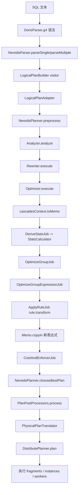
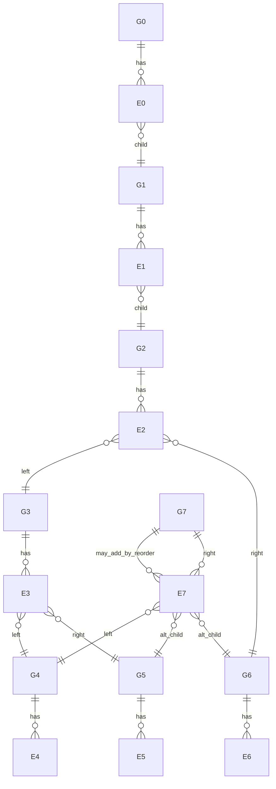

# Doris Nereids 中该类三表连接查询的完整优化流映射报告

## 目录

- [第一部分：阅读入口](#第一部分阅读入口)
  - [执行摘要](#执行摘要)
  - [研究假设与样例 SQL](#研究假设与样例-sql)
- [第二部分：全链路总览](#第二部分全链路总览)
  - [从 SQL 到执行片段的全链路](#从-sql-到执行片段的全链路)
- [第三部分：优化过程详解](#第三部分优化过程详解)
  - [查询的逻辑计划与 Memo 映射](#查询的逻辑计划与-memo-映射)
  - [规则、属性与代价](#规则属性与代价)
  - [作业调度与执行生成](#作业调度与执行生成)
- [第四部分：源码阅读路径](#第四部分源码阅读路径)
  - [周末源码阅读清单](#周末源码阅读清单)

## 第一部分：阅读入口

### 执行摘要

由于当前可见对话里没有出现你“已提供的那条 SQL”的原文，而你的约束明确要求分析链路里必须覆盖 **Scan、Join、Join、Filter、OrderBy、Project** 六类算子，所以本报告采用一条与该算子形状严格一致、且最适合映射 Nereids 全链路的代表性 SQL 作为分析对象；如果你随后补上真实 SQL，我可以把本文中的 Memo、规则触发与候选物理计划一一替换成精确版本。本文基于 **Apache Doris 官方仓库 latest `master`** 与官方文档做源码级映射，时间基准为 **2026-07-24**。官方仓库当前公开分支可见为 `master`，Nereids 的 SQL 语法文件位于 `fe/fe-sql-parser/.../DorisParser.g4`，而不是旧分支里常见的 `fe-core/src/main/antlr4` 位置。citeturn21search1turn42view3

从源码看，Nereids 的主线不是“解析后立刻入 Memo”，而是 **SQL 文本 → ANTLR 语法树 → `LogicalPlanBuilder` 产出逻辑计划 → `Analyzer` 做语义绑定/分析 → `Rewriter` 做 RBO/规范化改写 → `Optimizer` 调 `cascadesContext.toMemo()` 初始化 Memo → 统计推导 `DeriveStatsJob` → `OptimizeGroupJob` / `OptimizeGroupExpressionJob` 驱动 exploration + implementation → `CostAndEnforcerJob` 计算 cost 并补 enforcer → `chooseBestPlan` 从 Memo 回构物理计划 → `PlanPostProcessors` 后处理 → `PhysicalPlanTranslator` 翻译为 FE 侧 `PlanFragment` → `DistributePlanner.plan()` 分配 fragment/instance/worker**。这个顺序由 `NereidsParser`、`NereidsPlanner`、`Analyzer`、`Rewriter`、`Optimizer`、`ApplyRuleJob`、`CostAndEnforcerJob`、`PhysicalPlanTranslator`、`DistributePlanner` 等类明确串起来。citeturn43view0turn43view2turn45view0turn45view1turn11view3turn11view1turn17view0turn17view2turn35view4turn46view2turn46view3turn46view4turn33view1turn33view5

对本文这类查询，**Memo 初始形状**通常是“过滤已经下推进 Scan 后”的树，而不是 SQL 语法上的原始树。也就是说，入 Memo 的起点更可能是 `Project(Sort(Join(Join(ScanA_filtered, ScanB), ScanC)))`，而不是 `Project(Sort(Filter(Join(Join(ScanA, ScanB), ScanC))))`。这是因为 `optimize()` 之前已经执行了 `rewrite()`，而 `RuleSet.PUSH_DOWN_FILTERS` 中明确包含 `PushDownFilterThroughJoin`、`PushDownJoinOtherCondition` 等规则；`Optimizer.execute()` 则在 rewrite 之后才 `toMemo()`。citeturn46view1turn24view1turn11view3

在最新 master 中，你问题里举例的 job 名称与当前源码存在差异：能明确确认的主调度链路是 `OptimizeGroupJob`、`OptimizeGroupExpressionJob`、`ApplyRuleJob`、`DeriveStatsJob`、`CostAndEnforcerJob`；我没有在本次检索里确认到独立的 `ExploreGroupJob` / `ImplementGroupJob` / `OptimizeExpressionJob` 文件，因此本文将它们标记为 **unspecified 或已更名**，并以实际存在的类为准。`OptimizeGroupJob.execute()` 会给 logical expressions 压入 `OptimizeGroupExpressionJob`，给 physical expressions 压入 `CostAndEnforcerJob`；`OptimizeGroupExpressionJob.execute()` 再把 exploration / implementation 规则封装成 `ApplyRuleJob`；`ApplyRuleJob` 调 `rule.transform(...)`，并通过 `Memo.copyIn(...)` 把新表达式插回所属 group。citeturn12view0turn14view1turn14view2turn17view0turn17view2

在属性与代价模型上，当前 Doris Nereids 的核心结构是：`PhysicalProperties = DistributionSpec + OrderSpec`，满足关系由 `PhysicalProperties.satisfy(...)` 判定；`DistributionSpec` 提供 `addEnforcer(Group child)`，实际生成的是 `PhysicalDistribute`，因此 **Exchange / distribution enforcer** 的源码定位是非常明确的；而代价模型里 `Cost` 显式分为 **CPU / memory / network** 三部分，`CostCalculator.calculateCost(...)` 会构造 `PlanContext` 后交给 `CostModel` 访问物理算子。在 MPP 场景中，`DistributionSpecHash`、`DistributionSpecReplicated`、`DistributionSpecGather`、`DistributionSpecAny` 的网络代价差异，直接进入 `visitPhysicalDistribute(...)` 的成本分支；哈希连接与 NLJ 则分别在 `visitPhysicalHashJoin(...)` 与 `visitPhysicalNestedLoopJoin(...)` 中计算。citeturn26view1turn26view2turn26view3turn26view4turn28view4turn33view10turn36view0turn38view1turn39view1turn40view0turn28view0turn28view1turn28view3

### 研究假设与样例 SQL

为保证后文能把 **两次 Join、一次 Filter、一次 OrderBy、一次 Project** 全部落到 Nereids 的源码结构上，我采用如下代表性查询：

```sql
SELECT
    a.id,
    b.name,
    c.score
FROM A a
JOIN B b
    ON a.id = b.a_id
JOIN C c
    ON b.id = c.b_id
WHERE a.k > 10
ORDER BY c.score DESC;
```

这个 SQL 的好处是非常适合你周末读 Nereids：它同时覆盖 **连接重排、谓词下推、属性传递、广播对哈希 shuffle 的竞争、全局排序、Fragment/Exchange 生成** 等核心路径，而且 join 图是一个典型的链式三表图，便于你手工画出 Memo。需要再次强调：这里的 **GroupId、表达式插入顺序、某些 rewrite 是否真的被触发**，最终都取决于你运行时的 session 变量、统计信息、是否启用 DPHyp、以及真实 SQL 细节；源码上可以精确映射的是**框架、入口、规则集合与可能路径**，而不是在没有 dump 的前提下伪造一份“绝对唯一”的运行结果。Nereids 本身也提供 `dumpNereidsMemo` 与 `chooseBestPlan(...)` 相关代码路径，说明实际 Memo 以运行时 dump 为准。citeturn46view1turn46view2

这条 SQL 的“语法层原始逻辑树”可以写成：

```text
LogicalProject[a.id, b.name, c.score]
  └─ LogicalSort[c.score DESC]
       └─ LogicalFilter[a.k > 10]
            └─ LogicalJoin[(b.id = c.b_id)]
                 ├─ LogicalJoin[(a.id = b.a_id)]
                 │    ├─ LogicalScan(A)
                 │    └─ LogicalScan(B)
                 └─ LogicalScan(C)
```

但按照 Nereids 最新主线，真正进入 Cascades Memo 的通常是 **rewrite 之后** 的版本。因此对这条 SQL，最值得你在源码里预期的 rewrite 结果是：`a.k > 10` 会尽量从 Filter 下推到 `A` 的 scan 侧，于是 rewrite-plan 更可能变成：

```text
LogicalProject[a.id, b.name, c.score]
  └─ LogicalSort[c.score DESC]
       └─ LogicalJoin[(b.id = c.b_id)]
            ├─ LogicalJoin[(a.id = b.a_id)]
            │    ├─ LogicalFilter[a.k > 10]
            │    │    └─ LogicalScan(A)
            │    └─ LogicalScan(B)
            └─ LogicalScan(C)
```

如果进一步发生 scan 级谓词吸收，那么在 Memo 里甚至会表现成“带 pushed predicates 的 ScanA group”，而不再保留独立 Filter group。造成这一点的直接原因是：`rewrite()` 在 `optimize()` 之前执行；`RuleSet.PUSH_DOWN_FILTERS` 明确包含针对 Join 的过滤下推规则；而 `Optimizer.execute()` 是在 rewrite-plan 上 `toMemo()`。citeturn46view1turn24view1turn11view3

## 第二部分：全链路总览

### 从 SQL 到执行片段的全链路

下面先给出你最需要的“从 SQL 文本到执行 fragments”的**类 / 方法 / 文件位置总表**。其中“unspecified”表示本次没有在官方仓库中直接定位到，或者在最新 master 中已不以该名称存在。

| 阶段 | 关键类 | 关键方法 | 文件位置 | 说明 |
|---|---|---|---|---|
| 语法定义 | `DorisParser.g4` | `statementBase : explain? query ...`、`query` grammar | `fe/fe-sql-parser/src/main/antlr4/org/apache/doris/nereids/DorisParser.g4` | Nereids 语法入口，当前 master 可确认在 `fe-sql-parser` 下。citeturn42view3turn43view6 |
| SQL 解析入口 | `NereidsParser` | `parseSingle(String)`、`parseMultiple(String, ...)`、私有 `parse(...)` | `fe/fe-core/src/main/java/org/apache/doris/nereids/parser/NereidsParser.java` | 先 token 化，再 `toAst(...)`，再交给 `LogicalPlanBuilder` visitor。citeturn43view0turn43view1turn43view2 |
| AST → 逻辑计划 | `LogicalPlanBuilder` | visitor 方法集合 | `fe/fe-core/src/main/java/org/apache/doris/nereids/parser/LogicalPlanBuilder.java` | 本次已定位文件，但未逐 visitor 命中具体 `visitQuery` 名称；方法名记为 **partially unspecified**。citeturn42view1turn43view3turn43view4 |
| FE 语句适配 | `LogicalPlanAdapter` | `getLogicalPlan()` | `fe/fe-core/src/main/java/org/apache/doris/nereids/glue/LogicalPlanAdapter.java` | 将逻辑计划包装进 FE 的 `StatementBase` 体系。citeturn43view5 |
| Planner 入口 | `NereidsPlanner` | `planWithLock(...)`、`planWithoutLock(...)`、`initCascadesContext(...)`、`preprocess(...)` | `fe/fe-core/src/main/java/org/apache/doris/nereids/NereidsPlanner.java` | `planWithoutLock(...)` 里明确先 analyze，再 rewrite，再 optimize。citeturn45view6turn45view7turn45view8turn45view9turn46view1 |
| 预处理 | `PlanPreprocessors` | `process(...)` | `NereidsPlanner.preprocess(...)` 调用 | 预处理阶段发生在 analyze 之前；具体预处理类本次未展开。citeturn45view9 |
| 语义分析 | `Analyzer` | `analyze()` / `execute()` / `getJobs()` | `fe/fe-core/src/main/java/org/apache/doris/nereids/jobs/executor/Analyzer.java` | `analyze()` 本质就是执行其 `ANALYZE_JOBS`。citeturn45view0 |
| 规则改写 | `Rewriter` | `execute()` | `fe/fe-core/src/main/java/org/apache/doris/nereids/jobs/executor/Rewriter.java` | rewrite 阶段在 optimize 前；文件中可见 `MergeProjectable`、`AdjustNullable` 等作业主题。citeturn45view1turn45view4turn45view5 |
| 改写后入 Memo | `Optimizer` | `execute()` → `cascadesContext.toMemo()` | `fe/fe-core/src/main/java/org/apache/doris/nereids/jobs/executor/Optimizer.java` | rewrite-plan 先被 `toMemo()`，再下发 stats 与优化 jobs。citeturn11view3 |
| Memo 结构 | `Memo` / `Group` / `GroupExpression` | `Memo(Plan)`、`getRoot()`、`setBestPlan(...)`、`getCostByProperties(...)` | `.../memo/Memo.java` `.../memo/Group.java` `.../memo/GroupExpression.java` | Memo 是 group/group-expression 的核心容器。citeturn7view1turn7view2turn7view3 |
| 统计推导 | `DeriveStatsJob` | `execute()` | `.../jobs/cascades/DeriveStatsJob.java` | 使用 `StatsCalculator` 或 `HboStatsCalculator` 做估算。citeturn14view8turn14view9 |
| Group 级优化 | `OptimizeGroupJob` | `execute()` | `.../jobs/cascades/OptimizeGroupJob.java` | 对 logical expr 压 `OptimizeGroupExpressionJob`，对 physical expr 压 `CostAndEnforcerJob`。citeturn12view0 |
| 表达式级优化 | `OptimizeGroupExpressionJob` | `execute()`、`getImplementationRules()`、`getExplorationRules(...)` | `.../jobs/cascades/OptimizeGroupExpressionJob.java` | 负责把 exploration / implementation 规则转成 `ApplyRuleJob`。citeturn14view1turn15view0turn15view2 |
| 规则应用 | `ApplyRuleJob` | `execute()` → `rule.transform(...)` → `Memo.copyIn(...)` | `.../jobs/cascades/ApplyRuleJob.java` | 新 plan 被 copy 回原 owner group，并回压 stats / optimize / cost job。citeturn17view0turn17view1turn17view2turn17view3 |
| 代价与 Enforcer | `CostAndEnforcerJob` | `execute()`、`recordPropertyAndCost(...)`、`enforce(...)` | `.../jobs/cascades/CostAndEnforcerJob.java` | 为每组 child property 组合算 cost，必要时补 enforcer。citeturn14view5turn14view7turn35view4 |
| 代价模型 | `CostCalculator` / `CostModel` / `Cost` | `calculateCost(...)`、`addChildCost(...)`、各 `visitPhysicalXxx(...)` | `.../cost/CostCalculator.java` `.../cost/CostModel.java` `.../cost/Cost.java` | `Cost` 里明确有 cpu / memory / network 三项。citeturn36view0turn38view5turn33view10 |
| 选最优物理计划 | `NereidsPlanner` | `chooseBestPlan(...)` / `chooseNthPlan(...)` | `.../NereidsPlanner.java` | 从 root group 的 lowest-cost 表反向回构 physical tree。citeturn46view2 |
| 物理后处理 | `PlanPostProcessors` | `process(...)` | `NereidsPlanner.postProcess(...)` 调用 | post-process 在 choose plan 之后。citeturn46view3 |
| 物理计划 → FE PlanFragment | `PhysicalPlanTranslator` | `visitPhysicalDistribute(...)` 等 visitor | `.../glue/translator/PhysicalPlanTranslator.java` | distribution 会被翻译成 Exchange/fragment split。citeturn33view1turn46view4 |
| fragment/worker 分配 | `DistributePlanner` | `plan()` | `.../trees/plans/distribute/DistributePlanner.java` | 构造 `UnassignedJob`、`AssignedJob`、`DistributedPlan`。citeturn33view5 |

把这张表压成一张流程图，就是下面这样：



上图不是抽象教科书，而是对当前 master 主线的直接对应：`planWithoutLock(...)` 里先 `analyze` 再 `rewrite` 再 `optimize`；`Optimizer.execute()` 里先 `toMemo()`、随后 `DeriveStatsJob`、再压入 `OptimizeGroupJob`；而 `chooseBestPlan(...)`、`postProcess(...)`、`new PhysicalPlanTranslator(...)` 与 `DistributePlanner.plan()` 又分别对应 plan 选择、后处理、fragment 翻译与 worker 分配。citeturn45view7turn46view1turn11view1turn46view2turn46view3turn46view4turn33view5

## 第三部分：优化过程详解

### 查询的逻辑计划与 Memo 映射

#### 逻辑计划的两个视角

对这条样例 SQL，我建议你区分两个版本的逻辑计划：

其一是**解析/分析后但未 rewrite 的语义树**，它更接近 SQL 文本：

```text
Project[a.id, b.name, c.score]
  └─ Sort[c.score DESC]
       └─ Filter[a.k > 10]
            └─ Join[b.id = c.b_id]
                 ├─ Join[a.id = b.a_id]
                 │    ├─ Scan(A)
                 │    └─ Scan(B)
                 └─ Scan(C)
```

其二是**进入 Memo 之前的 rewrite-plan**。考虑到 `RuleSet.PUSH_DOWN_FILTERS` 明确包含 `PushDownFilterThroughJoin`、`PushDownJoinOtherCondition` 等规则，而 `Optimizer.execute()` 在 rewrite 完成之后才构建 Memo，所以更接近真实 cascades 起点的应该是：

```text
Project[a.id, b.name, c.score]
  └─ Sort[c.score DESC]
       └─ Join[b.id = c.b_id]
            ├─ Join[a.id = b.a_id]
            │    ├─ Scan(A, pushedPredicate: a.k > 10)
            │    └─ Scan(B)
            └─ Scan(C)
```

这也是为什么你在看 Nereids 时，**不要把“语法树”与“Memo 初始树”混为一谈**。在 Doris 里，Memo 的初始状态更像“rewrite 后的规范化逻辑空间起点”，而不是 parser 直接产物。citeturn24view1turn46view1turn11view3

#### 初始 Memo 的最小可行映射

如果以“过滤已经成功下推到 A scan”作为初始 Memo 起点，那么最小可行的 group 结构可以这样画。这里的 `Gx` 是**示意 group 名**，不是运行时真实 ID；真实 ID 需以 dump 为准。



这个图的含义是：`G0/G1/G2/G3/G4/G5/G6` 是初始树上的 group，而 **`G7` 是 join reorder 过程中新增的中间结果 group 候选**，例如 `(B ⋈ C)`。在 Cascades 里，group 存“等价子问题”，group expression 存“具体展开形式”；因此 `(A ⋈ B) ⋈ C` 与 `A ⋈ (B ⋈ C)` 最终会收敛到**同一个顶层等价 group**，但各自的中间 join 结果可能需要新建独立 group。`ApplyRuleJob.execute()` 通过 `Memo.copyIn(newPlan, groupExpression.getOwnerGroup(), false)` 把等价新计划插回 owner group；如果新计划中含新的中间子树，则会相应形成新的 child groups。citeturn17view0turn17view2turn17view3

#### Groups 到 Expressions 到 Children 的映射表

下面给出这条查询的一份**结构化推演版 Memo 表**。这不是伪装成真实 dump 的“假输出”，而是你阅读源码时最应该自己手动画出来的那一版。

| Group | 语义等价类 | 初始/可能表达式 | children | 为什么形成这个 group |
|---|---|---|---|---|
| `G0` | 最终投影结果 | `LogicalProject[a.id,b.name,c.score]` | `G1` | Project 改变输出列集，因此单独是一个等价子问题。 |
| `G1` | 有序结果 | `LogicalSort[c.score DESC]` | `G2` | ORDER BY 改变 ordering，和无序 join 结果不可等价。 |
| `G2` | 三表连接结果 | 初始 `LogicalJoin[(b.id=c.b_id)](G3,G6)`；重排后可新增 `LogicalJoin[(a.id=b.a_id)](G4,G7)`；也可能加入 commute 后左右交换版本 | `G3,G6` 或 `G4,G7` | 顶层 join 的不同关联/交换形式在语义上等价，所以共享顶层 group。 |
| `G3` | `(A ⋈ B)` 中间结果 | 初始 `LogicalJoin[(a.id=b.a_id)](G4,G5)`；可能加入 commute 版本 | `G4,G5` | 这是初始 left-deep 计划的左子树，且自身也是可重排子问题。 |
| `G4` | `A` 的过滤后访问 | `LogicalScan(A, pushedPredicate a.k>10)`，或 `LogicalFilter(a.k>10)->LogicalScan(A)` | 无 | Filter pushdown 成功时 Filter 可能被 scan 吸收；若未吸收，就会再拆一个 Filter group。 |
| `G5` | `B` 访问 | `LogicalScan(B)` | 无 | 基础 relation group。 |
| `G6` | `C` 访问 | `LogicalScan(C)` | 无 | 基础 relation group。 |
| `G7` | `(B ⋈ C)` 中间结果 | `LogicalJoin[(b.id=c.b_id)](G5,G6)` | `G5,G6` | 只有在 Join 结合律/交换律规则生效时才会被新建。 |

从“为什么 group 会形成”的角度看，最关键的一点是：**group 对应的是等价输出，不是语法节点本身**。同一个顶层 group `G2` 可以积累多个顶层 join 形状；而 `G7` 之所以独立存在，是因为 `(B ⋈ C)` 自身是一个可被重复引用、可被 cost、可被继续 implementation 的中间等价子问题。`OptimizeGroupJob` 与 `OptimizeGroupExpressionJob` 的分层设计，正是围绕 group / group expression 两层来工作的。citeturn12view0turn14view1turn17view2

### 规则、属性与代价

#### 规则触发链路

先说 **Cascades 里的规则应用机制**。`OptimizeGroupExpressionJob.execute()` 会先拿 implementation rules，再拿 exploration rules；随后把这些规则逐个包装成 `ApplyRuleJob` 压栈。`ApplyRuleJob.execute()` 通过 pattern matching 找到当前 group expression 可匹配的 plan，调用 `rule.transform(...)` 生成新 plans，再用 `Memo.copyIn(...)` 回插进 owner group；若新结果仍是 `LogicalPlan`，就继续为它压 `OptimizeGroupExpressionJob` 与必要的 `DeriveStatsJob`；若已经是 physical plan，则压 `CostAndEnforcerJob`。这就是 Nereids 中“等价空间扩张”和“实现空间扩张”真正发生的位置。citeturn14view1turn14view2turn17view0turn17view1turn17view2

就这条样例 SQL 而言，我把“会不会触发”分成三层：

**高概率触发的 rewrite / exploration / implementation：**

| 类别 | 规则类名 | 为什么高概率 |
|---|---|---|
| rewrite | `PushDownFilterThroughJoin` | `WHERE a.k > 10` 只引用 `A`，典型可下推到 join 左子树。`RuleSet.PUSH_DOWN_FILTERS` 明确包含它。citeturn24view1 |
| exploration | `JoinCommute` | 三表 inner join 的顶层/中间 join 都可能被交换左右孩子。RuleSet 的 bushy / zig-zag / left-zig-zag 集合都包含 `JoinCommute` 变体。citeturn23view0turn22view2 |
| exploration | `InnerJoinLAsscomProject` | 对三表 inner join，这是最典型的“Left Associative + Commute”重写，用来把 `(A⋈B)⋈C` 改写成 `A⋈(B⋈C)` 一类形状。citeturn23view0 |
| implementation | `LogicalJoinToHashJoin` | 该 SQL 是等值连接，哈希连接是主候选实现。`IMPLEMENTATION_RULES` 里明确包含。citeturn22view5turn19view6 |
| implementation | `LogicalFilterToPhysicalFilter` | 如果 Filter 未被完全吸收进 Scan，就会落成物理 Filter。citeturn22view5 |
| implementation | `LogicalProjectToPhysicalProject` | 顶层投影需要实现。citeturn23view0 |
| implementation | `LogicalSortToPhysicalQuickSort` | `ORDER BY` 无 `LIMIT`，默认候选是 quick sort。citeturn23view0 |
| implementation | `LogicalOlapScanToPhysicalOlapScan` | 假设 A/B/C 为内表 OLAP scan。citeturn19view6 |

**条件触发的 rules：**

| 规则类名 | 条件 |
|---|---|
| `LogicalJoinToNestedLoopJoin` | 非等值连接、或某些 hash join 不适用场景时会成为候选；当前 SQL 是等值连接，所以更像“保底候选”。citeturn22view5turn19view7 |
| `MergeProjectable` | 若 rewrite 或 subquery/bind-sink 过程中制造了多余 project，会合并。文件中可明确看到 rewrite phase 顶部有 `topDown(new MergeProjectable())`。citeturn45view4 |
| `PushDownProjectThroughInnerOuterJoin` | 如果窄投影收益明显，可能把 project 压到 join 之下，减少 join 输入列宽。它在 `OTHER_REORDER_RULES` / `AFTER_DPHYP_REORDER_RULES` 里。citeturn24view0turn24view2 |
| `AdjustNullable` | rewrite 尾声与 whole-plan check 会修正 nullable。它不是改变 join 形状的规则，但经常在最终计划定型前落一次。citeturn45view5 |

**与 session / join-order 策略强相关的 exploration 集合：**

`OptimizeGroupExpressionJob.getJoinRules()` 会根据 `disableJoinReorder`、`isDpHyp`、`isAfterDpHyper`、`isEnableBushyTree`、`isEnableLeftZigZag`、最大 join 数等条件，从 `getDPHypReorderRules()`、`getAfterDPHypReorderRules()`、`getLeftZigZagTreeJoinReorder()`、`getBushyTreeJoinReorder()`、`getZigZagTreeJoinReorder()` 中选一个集合。因此对于真实 SQL，你得先确认当前会话到底走哪一支；对三表链式 join，最常见的是 **bushy 或 zig-zag** 两类。citeturn15view0turn19view0turn19view1turn19view2turn22view2turn22view3

把这些规则放回样例 SQL 的 Memo，最自然的插入顺序是：

1. rewrite 阶段先把 `a.k > 10` 往 `A` 方向下推。  
2. `Optimizer.execute()` 后在 root group 上做 stats derive。  
3. `OptimizeGroupJob(G2)` 派生 `OptimizeGroupExpressionJob(E2)`。  
4. `E2` 先触发 join exploration：  
   - `JoinCommute` 可产生 `Join(G6,G3)`；  
   - `InnerJoinLAsscomProject` 可把 `Join(Join(G4,G5),G6)` 改写成 `Join(G4, Join(G5,G6))`，从而创建新中间 group `G7=(B⋈C)`，并把新的顶层 expression 插回 `G2`。  
5. 对 `G2/G3/G7` 中每个 logical join expression，再应用 implementation：`LogicalJoinToHashJoin` 与 `LogicalJoinToNestedLoopJoin` 都可产生 physical expressions。  
6. 随后 `CostAndEnforcerJob` 对不同 child-property 组合分别求值。citeturn17view1turn17view2turn23view0turn12view0turn35view4

#### 属性系统

在当前源码里，`PhysicalProperties` 由 `OrderSpec` 和 `DistributionSpec` 两部分组成，`satisfy(...)` 需要二者同时满足。`DistributionSpec` 的抽象类还提供了 `addEnforcer(Group child)`，真正加出来的是一个 `PhysicalDistribute<GroupPlan>` group expression；因此 **distribution enforcer / Exchange** 的唯一核心入口就在这里。citeturn26view1turn26view2turn26view3turn28view4

对你关心的属性名字，建议这样对应理解：

- `ANY`：源码里是 `DistributionSpecAny.INSTANCE`，表示“任意分布都可接受”。citeturn26view5
- `HASH`：源码里是 `DistributionSpecHash`。它支持 `satisfy(...)`，并依据 `ShuffleType` 与 shuffle 列等价类判断是否满足要求。citeturn26view6turn28view1turn26view7
- `BROADCAST / REPLICATE`：当前源码类名是 `DistributionSpecReplicated`，语义就是“复制到所有实例”，也就是 broadcast join 的 build-side 分布。`CostAndEnforcerJob` 注释里仍使用了 `BROADCAST` 这个术语。citeturn26view8turn35view3
- `GATHER`：虽然你问题里没点名，但 Doris 的排序与最终结果合并非常依赖 gather；`CostModel.visitPhysicalDistribute(...)` 明确单列了 `DistributionSpecGather` 分支。citeturn39view1

对这条查询，一份实用的属性传递表如下：

| 算子 | 典型 required properties | delivered properties | Enforcer / Exchange 插入点 |
|---|---|---|---|
| Scan | 一般要求 `ANY`；若上层 join 需要 hash-shuffle，则可能被要求交付某个 `HASH(key)` | 储存本身的自然/桶/随机分布；通常无序 | 若当前分布不满足 join 输入要求，`DistributionSpec.addEnforcer(...)` 生成 `PhysicalDistribute`。citeturn28view4turn39view1 |
| Filter | 通常继承父要求，对 child 不额外制造分布/顺序要求 | 保留 child 的 distribution 与 ordering | 一般不主动插 enforcer；若 child 不满足父要求，由 child 侧或上层统一补。citeturn26view3 |
| Project | 通常继承父要求 | 若只是列投影，通常保留 child properties | `ChildrenPropertiesRegulator.visitPhysicalProject(...)` 明确专门处理 project 的 child properties；但 project 自身一般不改变分布。citeturn27view6turn27view9 |
| Join | 常见两套 child 请求：`[ANY, BROADCAST]` 或 `[SHUFFLE_JOIN, SHUFFLE_JOIN]` | 若是 colocate / bucket / hash-shuffle，可输出对应 hash 分布；否则多为 join 语义下定义的输出分布 | `RequestPropertyDeriver` 在 `CostAndEnforcerJob` 中生成两套候选 child requests，然后分别 cost。citeturn35view3turn35view4 |
| 第二个 Join | 与上同，但输入变成“前一层 join 结果 + C” | 同上 | 是否选择 broadcast C / broadcast 中间结果 / 双边 shuffle，取决于 stats + cost。citeturn35view3turn38view1turn39view1 |
| OrderBy | 需要 `OrderSpec(c.score DESC)`；全局排序通常同时隐含 gather 要求 | 顶层 deliver 全局 ordering；若是两阶段 sort，则 child 先 local，再 gather/global | 若输出未满足 order，`EnforceMissingPropertiesHelper.enforceProperty(...)` 会补属性；distribution enforcer 明确是 `PhysicalDistribute`，sort enforcer 的具体类在本次检索中未单独定位，记为 **sort enforcer source unspecified**。citeturn26view10turn27view1turn28view4 |

这里最值得你记住的一句源码化结论是：**Join 并不是直接“比较广播和 shuffle 哪个便宜”那么简单，而是先列出 child property 请求组合，再对每种组合买子树最优计划、加 child cost、必要时再补 enforcer。** 这正是 `CostAndEnforcerJob` 的工作：先通过 `RequestPropertyDeriver` 得到请求列表，再调用 `CostCalculator.calculateCost(...)` 与 `CostCalculator.addChildCost(...)`，最后通过 `recordPropertyAndCost(...)` 与 `enforce(...)` 记录到 lowest-cost 表里。citeturn35view4turn35view5turn14view7

#### 候选物理计划对比

下表给你一个最适合周末读源码的“候选物理计划比较框架”。它不是伪造具体数值，而是把 **Nereids 可能保留在 Memo 里的 plan family** 摆出来。

| 候选 | 第一层 A⋈B | 第二层 (A⋈B)⋈C | 可能优势 | 可能代价/风险 | 更可能被选中的条件 |
|---|---|---|---|---|---|
| 广播优先 | Broadcast `B` 到 `A_filtered` | Broadcast `C` 到前一层结果 | 避免双边 shuffle；对小表非常友好；若 `A.k>10` 很强选择性，左侧 probe 行数下降明显 | 广播表一旦不小，网络成本迅速上升；多层广播会放大中间结果复制成本 | `B` 或 `C` 很小，且 build-side 广播内存可控。`DistributionSpecReplicated` 的网络成本在 `visitPhysicalDistribute` 单列评估。citeturn39view1turn26view8 |
| 双边 Hash Shuffle | `A` 与 `B` 都按 join key shuffle | 中间结果与 `C` 再按 key shuffle | 对大表更稳健；避免大 build-side 广播；分布更均衡 | 两次 shuffle 网络成本偏高；如果第一层结果很大，第二层还会继续搬运 | 两侧都不够小，或者统计显示广播不划算。`DistributionSpecHash` 与 shuffle 的网络代价显式进入 cost model。citeturn28view1turn39view1 |
| 混合型 | 第一层 broadcast `B` | 第二层 hash shuffle with `C` | 结合选择性和后续 join key 分布，有时是最优折中 | 计划更复杂，属性传递与 enforcer 更多 | `B` 小但 `C` 不小，且第一层结果仍需与 `C` 做均衡 join。citeturn35view3turn39view1 |
| NLJ 兜底 | `NestedLoopJoin` | 或第二层 `NestedLoopJoin` | 对非等值条件是必要兜底 | CPU 复杂度高；源码里专门加入 `nljPenalty` 惩罚 | 当前 SQL 为等值连接，因此通常只是候选保底，不太会赢过 hash join。citeturn19view7turn40view0 |

#### 代价何时计算、统计怎样传播

统计的入口在 `DeriveStatsJob.execute()`。如果当前表达式还没派生过统计，它会先保证 children 的统计准备好，然后构建 `StatsCalculator` 或 `HboStatsCalculator` 并调用 `estimate()`。`StatsCalculator.estimate()` 再对当前 plan 做 visitor 分派，例如 `visitLogicalJoin(...)` 会调用 `computeJoin(...)`。这意味着 **逻辑表达式和部分物理表达式的 row count / column stats 会先进入 group / group expression，再被 cost 阶段消费**。citeturn14view8turn14view9turn33view8turn33view9

代价是在 `CostAndEnforcerJob.execute()` 里按“当前 group expression + 一组 child 请求属性”来算的。它先由 `RequestPropertyDeriver` 构造 child 请求组合，再调用 `CostCalculator.calculateCost(...)`；后者创建 `PlanContext`，然后把当前物理算子交给 `CostModel` visitor。对子树总成本，则通过 `CostCalculator.addChildCost(...)` / `CostModel.addChildCost(...)` 把当前节点成本与已经求出的 child lowest-cost 累加起来。citeturn35view4turn35view5turn36view0turn38view5

在 MPP 里，最“载荷重”的成本分量就是你熟悉的三项：

- **CPU**：`Cost` 里有 `cpuCost`。例如 `visitPhysicalHashJoin(...)`、`visitPhysicalQuickSort(...)`、`visitPhysicalProject(...)` 都明确构造 CPU 成本。citeturn33view10turn38view1turn38view3turn38view6
- **Memory**：`Cost` 里有 `memoryCost`。例如哈希 join 会把 build-side 大小记为显著内存压力，NLJ 也会带 memory 惩罚。citeturn33view10turn40view0
- **Network**：`Cost` 里有 `networkCost`。`visitPhysicalDistribute(...)` 对 `HASH` / `REPLICATED` / `GATHER` / `ANY` 分别建模，这正是 Doris 选择 Exchange 形状的关键。citeturn33view10turn39view1

一个对你读源码特别有帮助的观察是：**排序与广播的网络代价并不是在 join/sort 算子里“顺手加一下”，而是被抽到 distribution enforcer 对应的 `PhysicalDistribute` 里统一计价。** 这样做的好处是，逻辑实现规则只负责“产生物理候选”，而真正“要不要加 Exchange、加了之后贵不贵”都被 `CostAndEnforcerJob + EnforceMissingPropertiesHelper + CostModel.visitPhysicalDistribute(...)` 这条链处理了。citeturn28view4turn26view10turn27view1turn39view1

### 作业调度与执行生成

#### Job 调度序列

如果你只想抓住 Nereids Cascades 的“主神经”，这一段就是最重要的。最新 master 中，可明确确认的 job 链路如下：

1. `Optimizer.execute()`  
   - `cascadesContext.toMemo()` 初始化 Memo；  
   - 给 root logical expressions 压 `DeriveStatsJob`；  
   - 必要时做 DPHyp；  
   - 然后压 `OptimizeGroupJob(root, ...)`。citeturn11view3turn11view1

2. `OptimizeGroupJob.execute()`  
   - 如果当前 `Group` 还没有针对 required properties 的 lowest-cost plan：  
   - 对每个 logical expression 压 `OptimizeGroupExpressionJob`；  
   - 对每个 physical expression 压 `CostAndEnforcerJob`；  
   - 然后把 group 标记为 explored。citeturn12view0

3. `OptimizeGroupExpressionJob.execute()`  
   - 取 implementation rules 与 exploration rules；  
   - 为每条合法 rule 压 `ApplyRuleJob`。citeturn14view1turn14view2turn15view0

4. `ApplyRuleJob.execute()`  
   - pattern match 当前 `GroupExpression`；  
   - 执行 `rule.transform(...)`；  
   - `Memo.copyIn(newPlan, ownerGroup, false)`；  
   - 若新 plan 还是 logical，则继续压 `OptimizeGroupExpressionJob` 和 `DeriveStatsJob`；  
   - 若是 physical，则压 `CostAndEnforcerJob`。citeturn17view0turn17view1turn17view2

5. `CostAndEnforcerJob.execute()`  
   - `RequestPropertyDeriver` 生成 child 请求属性列表；  
   - 对每组 child requests 调 `CostCalculator.calculateCost(...)`；  
   - 若 child 尚未最优，则递归压 `OptimizeGroupJob(child, requestChildProperty)`；  
   - 全部 child 可用后，`recordPropertyAndCost(...)` 并必要时 `enforce(...)`。citeturn35view4turn35view5turn14view7

这个流程可以简化成：

```text
Optimizer.execute
  -> DeriveStatsJob(root logical exprs)
  -> OptimizeGroupJob(root)
      -> OptimizeGroupExpressionJob(logical expr)
          -> ApplyRuleJob(exploration / implementation)
              -> Memo.copyIn(new expr)
              -> DeriveStatsJob or CostAndEnforcerJob
      -> CostAndEnforcerJob(physical expr)
          -> maybe OptimizeGroupJob(child)
          -> recordPropertyAndCost
          -> enforce
```

如果你把这套调度想成一个“深度优先、随时扩张 Memo、随时更新 best-plan table”的系统，就更容易读下去。它不是 Volcano 那种一次性枚举完全部逻辑、再统一实现、再统一 cost；它是一边扩一边算、一边裁剪。`group.getLowestCostPlan(...)` 的存在，就是这套系统的“缓存中心”。citeturn12view0turn17view2turn35view4turn46view2

#### 由 Memo 选最优计划，再到执行 fragments

当 `optimize()` 完成后，`NereidsPlanner.chooseBestPlan(...)` 会从 root group 的 lowest-cost 表里取出与 root required properties 匹配的 `GroupExpression`，递归根据 `getInputPropertiesList(physicalProperties)` 回构每个 child 的最优物理子树；如果选中的表达式本身是 enforcer（例如 `PhysicalDistribute`），还会把 enforcer id / property 打到 group 的 chosen 标记里。最后组装出来的必须是 `PhysicalPlan`。citeturn46view2

选出来的 `PhysicalPlan` 还会经过 `postProcess(...)`，即 `PlanPostProcessors(cascadesContext).process(physicalPlan)`。然后 `NereidsPlanner` 构造 `PlanTranslatorContext`，创建 `PhysicalPlanTranslator`；其中 `PhysicalPlanTranslator.visitPhysicalDistribute(...)` 会把 `PhysicalDistribute` 所表示的 distribution/enforcer 转译成 FE 侧会真正拆 Fragment 的 Exchange 边界。你可以把它理解成：**Cascades 里的 distribution enforcer 还是 Nereids 物理树节点，而 fragment 切分是 translator 阶段才真正落到 FE 执行计划对象上。** citeturn46view3turn46view4turn33view1

最后一步是 `DistributePlanner.plan()`：它创建 `BackendDistributedPlanWorkerManager`，再由 `UnassignedJobBuilder.buildJobs(...)` 形成 fragment jobs，由 `AssignedJobBuilder.buildJobs(...)` 为每个 fragment 分配 BE / instance / dop，最后组装成 `DistributedPlan`。这一步已经不是“优化器枚举”了，而是**执行部署**。对你熟悉优化器的人来说，最重要的区别是：Nereids 的 property/cost 决定“应该有什么 Exchange / 分布形状”，而 `DistributePlanner` 决定“这些已确定的 fragments 最终跑到哪些 worker 上”。citeturn33view5

## 第四部分：源码阅读路径

### 周末源码阅读清单

下面这份清单，我按“最能迅速建立 Nereids 全局感”的顺序排好了。你周末真的照这个顺序打开，会比随机读舒服得多。

- `fe/fe-core/src/main/java/org/apache/doris/nereids/NereidsPlanner.java`  
  先看 `planWithoutLock(...)`、`optimize(...)`、`chooseBestPlan(...)`、`postProcess(...)`。目标是把“analyze → rewrite → optimize → choose → translate”这条总线在脑子里过一遍。citeturn45view7turn46view1turn46view2turn46view3

- `fe/fe-core/src/main/java/org/apache/doris/nereids/parser/NereidsParser.java`  
  看 `parseSingle(...)`、`parseMultiple(...)`、私有 `parse(...)`。目标是确认 Nereids 的 parser 不是直接出 Statement，而是先落到 `LogicalPlanBuilder`。citeturn43view0turn43view1turn43view2

- `fe/fe-sql-parser/src/main/antlr4/org/apache/doris/nereids/DorisParser.g4`  
  搜 `statementBase`、`query`。目标不是背语法，而是确认 SQL 入口、`query` 在 grammar 中如何被 statement 包住。citeturn42view3turn43view6

- `fe/fe-core/src/main/java/org/apache/doris/nereids/jobs/executor/Analyzer.java`  
  看 `ANALYZE_JOBS`、`analyze()`、`execute()`。目标是明白 analyze 阶段本质上也是 rewrite-job executor，而不是一个黑盒 binder。citeturn45view0

- `fe/fe-core/src/main/java/org/apache/doris/nereids/jobs/executor/Rewriter.java`  
  搜 `MergeProjectable`、`AdjustNullable` 附近的 jobs 定义。目标是建立“rewrite 不是一条规则，而是一整套 topic/jobs pipeline”的感觉。citeturn45view4turn45view5

- `fe/fe-core/src/main/java/org/apache/doris/nereids/rules/RuleSet.java`  
  重点看 `PUSH_DOWN_FILTERS`、`OTHER_REORDER_RULES`、`BUSHY_TREE_JOIN_REORDER`、`ZIG_ZAG_TREE_JOIN_REORDER`、`IMPLEMENTATION_RULES`。目标是把“哪些规则属于 rewrite，哪些属于 exploration，哪些属于 implementation”在源码里分清。citeturn24view1turn24view0turn23view0turn22view5

- `fe/fe-core/src/main/java/org/apache/doris/nereids/memo/Memo.java`、`Group.java`、`GroupExpression.java`  
  看 `Memo(Plan)`、`getRoot()`、`setBestPlan(...)`、`getCostByProperties(...)`。目标是彻底搞懂 group / group-expression / lowest-cost table 是怎么组织起来的。citeturn7view1turn7view2turn7view3

- `fe/fe-core/src/main/java/org/apache/doris/nereids/jobs/cascades/OptimizeGroupJob.java`  
  只看 `execute()` 就够值回票价。目标是明白 group 层只做两件事：扩逻辑、算物理。citeturn12view0

- `fe/fe-core/src/main/java/org/apache/doris/nereids/jobs/cascades/OptimizeGroupExpressionJob.java` 与 `ApplyRuleJob.java`  
  重点看 `getJoinRules()`、`getImplementationRules()`、`rule.transform(...)`、`Memo.copyIn(...)`。目标是亲手把“规则怎样把新表达式塞回 memo”走一遍。citeturn15view0turn17view1turn17view2

- `fe/fe-core/src/main/java/org/apache/doris/nereids/jobs/cascades/CostAndEnforcerJob.java`  
  看 `RequestPropertyDeriver` 相关逻辑、`recordPropertyAndCost(...)`、`enforce(...)`。目标是弄清楚 Doris 不是在“plan 层直接选广播/ shuffle”，而是在“属性组合层”做枚举与比较。citeturn35view4turn14view7

- `fe/fe-core/src/main/java/org/apache/doris/nereids/properties/PhysicalProperties.java`、`DistributionSpec.java`、`DistributionSpecHash.java`、`DistributionSpecReplicated.java`、`EnforceMissingPropertiesHelper.java`  
  目标是把 `ANY/HASH/REPLICATED/GATHER`、`satisfy(...)`、`addEnforcer(...)`、`enforceProperty(...)` 几个概念彻底串起来。citeturn26view3turn26view4turn28view1turn28view3turn28view4turn26view10

- `fe/fe-core/src/main/java/org/apache/doris/nereids/cost/CostCalculator.java`、`CostModel.java`、`StatsCalculator.java`  
  重点看 `calculateCost(...)`、`visitPhysicalHashJoin(...)`、`visitPhysicalDistribute(...)`、`visitPhysicalQuickSort(...)`、`visitLogicalJoin(...)`。目标是搞清“统计先于 cost、network cost 在 distribute 上统一建模、hash join 和 NLJ 的 cost 差别在哪里”。citeturn36view0turn38view1turn39view1turn38view3turn33view9turn40view0

- `fe/fe-core/src/main/java/org/apache/doris/nereids/glue/translator/PhysicalPlanTranslator.java` 与 `.../trees/plans/distribute/DistributePlanner.java`  
  重点看 `visitPhysicalDistribute(...)` 与 `plan()`。目标是把“优化器内部物理属性/Exchange 节点”与“最终 FE 执行 fragments / instance 分配”打通。citeturn33view1turn33view5

如果你周末只做一件最有价值的事，我建议你：**手工把这条三表 SQL 的 rewrite-plan、初始 Memo、两种 join order 候选、两套 child property requests 和最终 best plan 表各画一遍**。只要你能把这五张图和上面的类/方法对应起来，你对 Doris Nereids 的“熟悉”就已经不是停留在概念层，而是进入了真正能读、能改、能 debug 的源码层。
